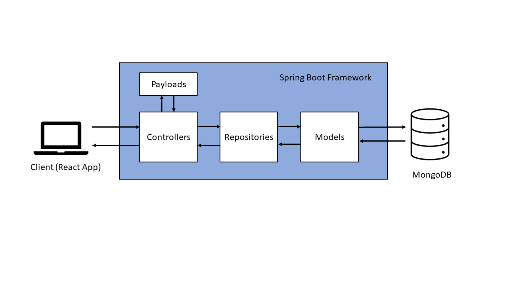

# Java Server Chitter

<details>
  <summary>Table of Contents</summary>
  <ol>
    <li><a href="#about-the-project">About The Project</a></li>
    <li><a href="#built-with">Built With</a></li>
    <li><a href="#getting-started">Getting Started</a></li>
    <li><a href="#problem-statements">Server Architecture</a></li>
    <li><a href="#project-review-and-roadmap">Project Review and Roadmap</a></li>
  </ol>
</details>

---

## About The Project

This product is a `Java` and `Spring Boot` implementation of the backend server for my previous [Chitter project](https://github.com/gibbuk/chitter-challenge-public). The previous project used `Node` as the server layer. 

I thought this would be a really interesting learning experience to go back to previously working solution and carrying out the equivalent of a very significant migration from one server framework to the other. It would help me compare and contrast the similarities between frameworks on different platforms and let me reevaluate previous design decisions that I made in the past as a less experienced developer. 

- [Here](https://github.com/gibbuk/chitter-client) is a link to the accompanying frontend app for this project.

- [Here](Log.md) is a link to a log of my reflections on my development process.

- [Here](requirements.md) is a link to requirements in the form of user stories, expected API routes and tests.

---

## Built With

Built in `java 11`  using `Spring Boot 2.6.3` and `Maven`. 

`MongoDB` is used as the data persistence layer.

## Getting Started

1. clone this repo.
2. Install dependencies via Maven (e.g. `mvn clean dependency:copy-dependencies`).
3. Unit tests can be run with `mvn test`.
4. Ensure you have MongoDB running on `localhost:27012`.
5. `mvn spring-boot:run` to run the server.
6. If you also want the front end you will need to clone [Chitter project](https://github.com/gibbuk/chitter-challenge-public) and follow the instructions for running the client.

To connect to a MongoDB Atlas instance amend `application.properties` file to add:
```
spring.data.mongodb.uri=mongodb+srv://<connection string>
```
and comment out:
```
spring.data.mongodb.database=chitter_java_test
spring.data.mongodb.port=27017
```

---
## Server Architecture



The Spring Boot server receives HTTP requests via REST controllers. These determine the action to be taken determined on the type of request and payload received. In order to access documents from the database controllers communicate with repositories which are interfaces for interacting with the MongoDB instance. Models define the document contents stored in the database and also which collection the documents are stored in. E.g. a `User` model defines user data that is stored in the `users` collection of the MongoDB database.

These components are sitting within the Spring Boot framework and rely on functionality provided Spring Boot. For example annotations like `@Autowired` to connect instances of our components together for us or using `application.properties` to define properties to be used across the server as a whole.

---

## Project Review and Roadmap

This project has been a really fun and interesting piece of learning. 

Through re-implementing a previous project in a new framework, I feel I really got a sense into what managing technical debt and implementing large scale changes must be like. I could see that originally I had made some design decisions with the original project that I would not make now. 

For example:
- having the server having to conform to request payloads that provide more data than is necessary to ensure the frontend would continue to work.
- that the `Peep` model could be improved. It could be amended to remove the `username` and `realName` as this duplicates information held elsewhere in the database. However, this would break the ability to use the server with any pre-existing databases.    

In the end I choose to retain the payloads and database models as they were to ensure that the server could seamlessly be used with the pre-existing frontend and database. It was really gratifying to see the frontend loading data from a pre-existing MongoDB Atlas Cloud instance via the new Spring Boot server! I recognise though that this decision has rolled over the technical debt of the previous project.

Features that I would like to add in the future:
- Integration tests in addition to the unit tests.
- Use of PUT and DELETE routes to allow users to edit or delete their own tweets.
- More secure authentication system using Json Web Tokens and only storing hashed/encrypted passwords.
- Ability for users to "like" other peoples' peeps.
- Add Roles to users to allow users to have different privileges. For example a moderator role who could delete any tweet.


